# Front-End-Project-Portfolio
Portfolio for professional development, centered around my Front End projects
 

### Introduction
 
During this sprint I worked solely on front end stories related to the C# project.  Being front end focused while working on a team that had members working across the entire stack really gave a sense of what it’s like working on a development team.  We were all working on different pieces of the same project but from totally different approaches.  For a portion of this sprint I was also working on creating mobile views for our site which was an entirely new experience for me which only made it even more rewarding when the views came out great!  I learned a lot during this sprint about visual design and about CSS hierarchies. 
 
See below for details about the stories I worked on during this sprint.
 
Background color fix on home/index:
This story was a quick fix, the background colors for the cards on the homepage needed to be changed to match the rest of the sites root colors and the jumbotron title needed to be centered within its parent div and pop more against the changing background.
 
With a couple of quick changes to the site CSS everything was fixed.
 
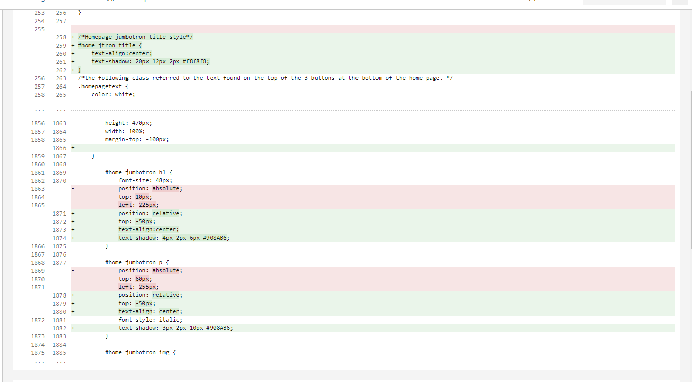
 
The next story was doing a tweak to the side navbar.  The original developer had done the spacing using li tags and my project manager wanted me to figure out a way to maintain optimal spacing without the use of the li tags or br tags for both the mobile and desktop views.  
To accomplish this, I created new social media icon spacing CSS classes to apply to the icons.  This way I could more easily control their position on the page, and it would be much easier for future developers to work with.
 
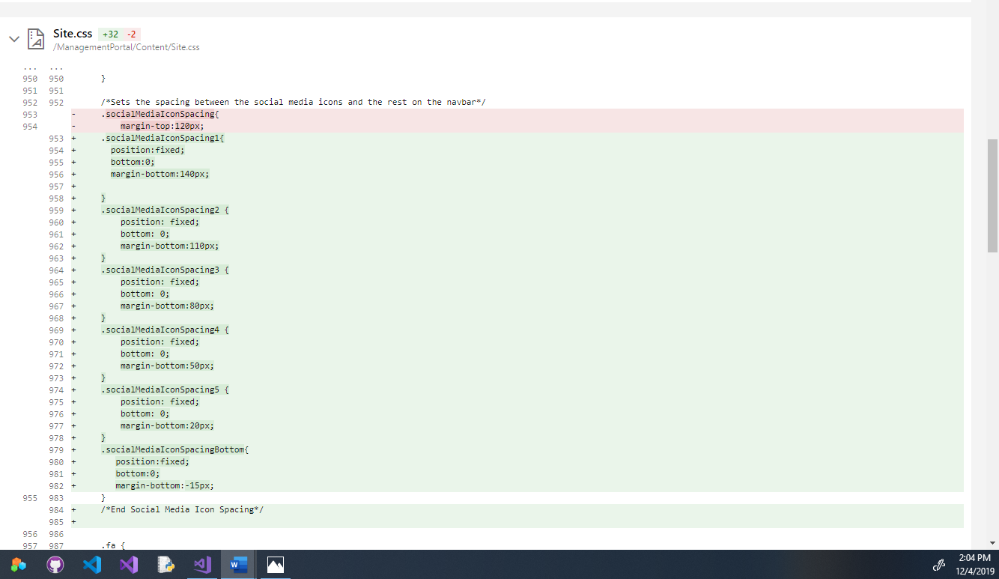
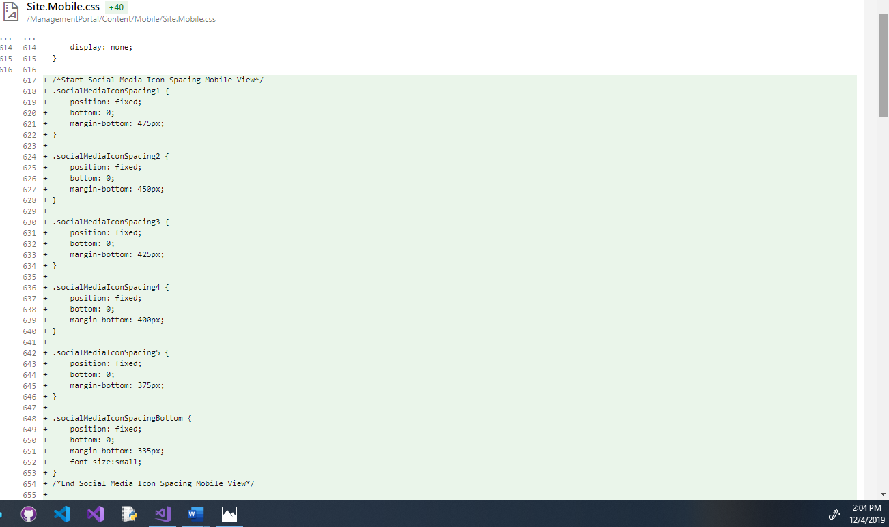
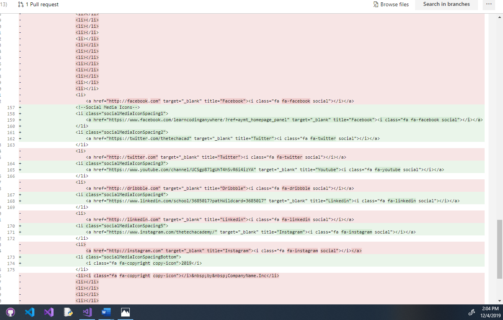
 
The next story I worked on was all about fixing the mobile friendly home/dashboard.  When I started on it the mobile dashboard had a ton of issues with it, there were buttons living outside of their containers and the general look was not good.  There were many styling inconsistencies between the mobile and desktop site as well that needed to be addressed.
 
This was the initial display when I started on this story.
 
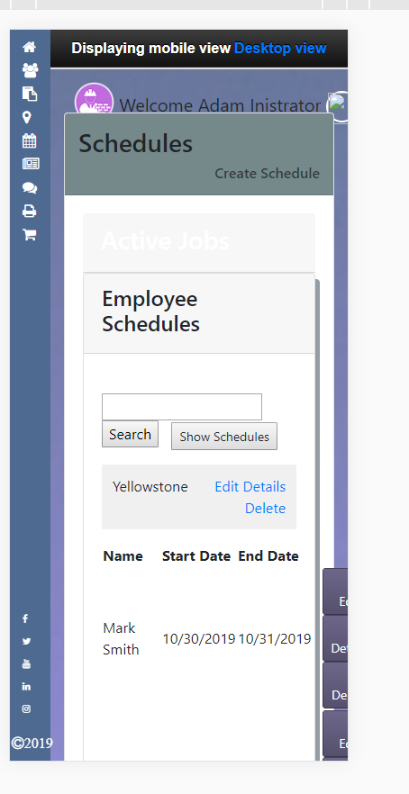
 
There was a lot that needed to be done for the mobile dashboard to be functional.  First things first I needed to get everything contained within the containers so the view would fit the screen.  The main issue was that all the partial views were just the desktop views being crammed onto a small screen.  I went through and made new mobile partial views for each of the partials displayed on the screen.
 
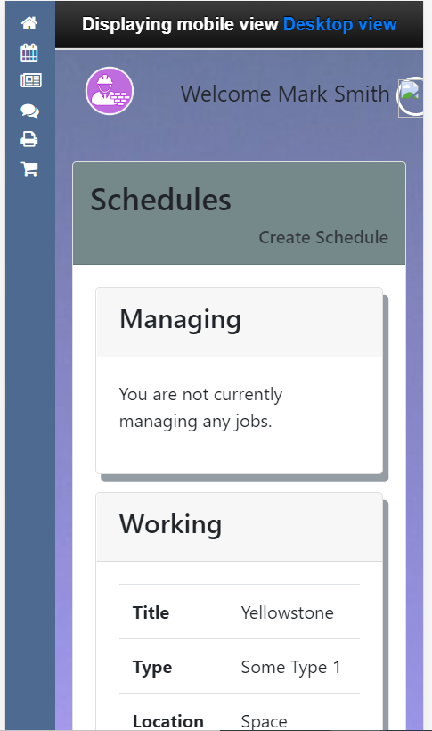
 
Once that was done, I needed to recreate the buttons on the page and match them to the style used for the mobile site.  
 
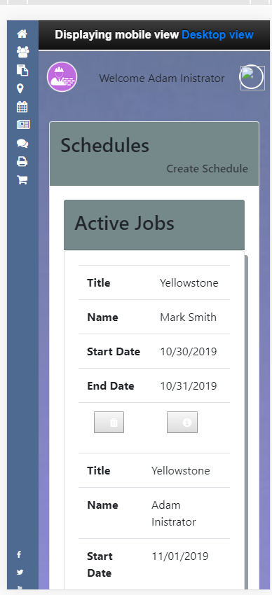
 
The result was a home/dashboard page that was functional and now matched the style of the rest of our site.  

Next, I worked on fixing the schedule items detail page.  The issue was that from the schedule item detail page there was not a direct path to get information about the job that the schedule was made for.  This was the initial story, but I noticed while getting to work on it that there was a lot of access for employees as far as editing the schedule or editing the job information that I was unsure we would want them to have.  I reached out to the project manager and asked if I could also fix these access issues by creating more separate employee pages so that edit access would be limited to management and admin access.  After getting the okay on my idea I set to work implementing it.  I created separate views for the employees and admins and made the job title into a link to get to the job details page.  I unfortunately didn’t take any screenshots of this process because I was too focused on writing the code to remember to document it for my portfolio.  However, the result was a more usable schedule items page that had properly restricted access for the employees while still allowing admins and management all the access that they require.  

After that story I set to work on creating the delete pages button for the entire site.  This story required me to go through every delete view on the site and fix every delete and back to list buttons on the site.  The delete views were made before the custom button partials were developed and so my job was to go back through and change them to fit the more modern button partials we were utilizing across the site. 

The site had custom made anchor buttons designed before I was on the project, so I had to figure out more about them and learn how to implement them.
 
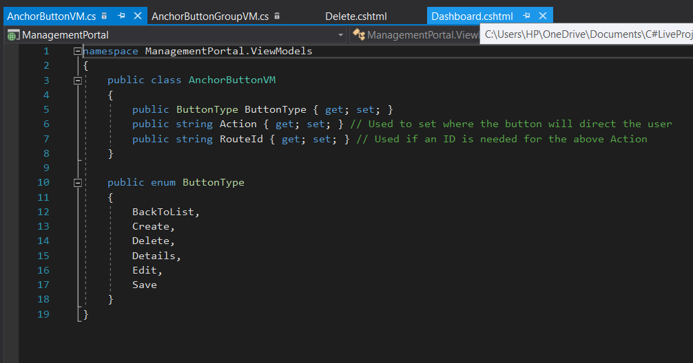
 
 I quickly figured out that the button partials that were designed with our site would not function the way I needed them to.  They were useful in some situations just not the ones I needed them for, so insead of removing them I created a custom button that looked identical that I could code to get the job done the way the story called for.
 
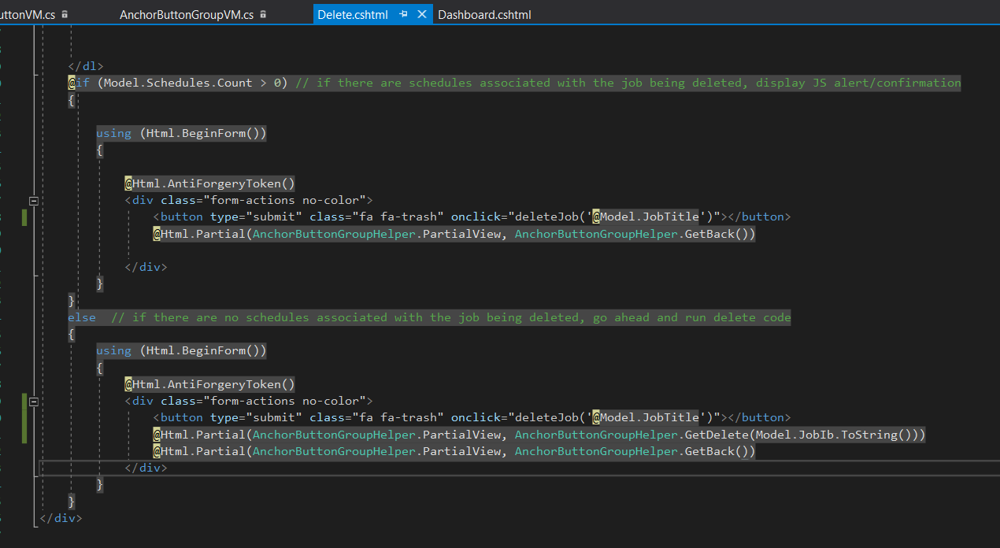
 
The custom button I created matched the original anchor button design exactly and was easy to impliment across all of the sites delete views.
 
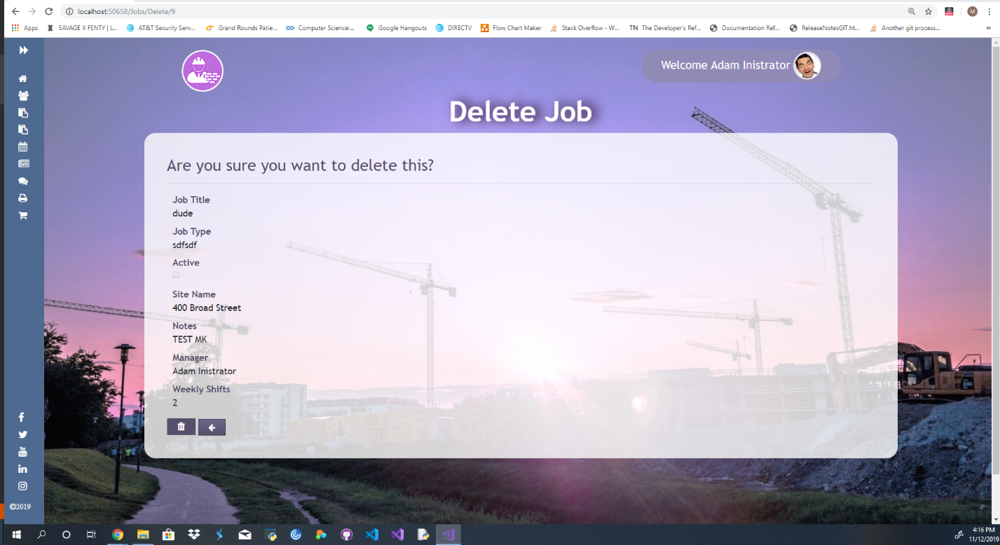
 
The final story I worked on during this sprint was to create a mobile friendly landing page.  I had already done the home/dashboard for our mobile view and I wanted to continue learning how to work on mobile design.  When I started the mobile version of the landing page was just like most other pages, it was just the desktop version crammed onto a smaller screen and did not have any flexibility to it.  I needed to create a landing page taking a liquid approach so that it would be able to display across many different types of mobile devices.

This is the original landing page before I started to work on it, as you can see there are a lot of issues when displayed on an iPhone X viewport.
 
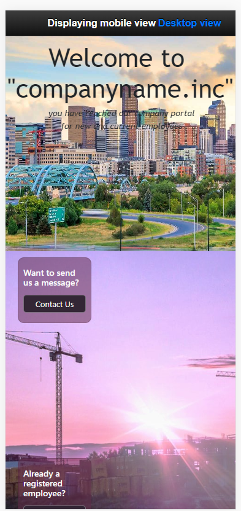
 
The first thing I did was create a mobile index view so that I could ensure I would not disrupt the desktop view.  I set an if statement in the layout page that if the viewport got below a certain size it would automatically kick over to the mobile view.
 
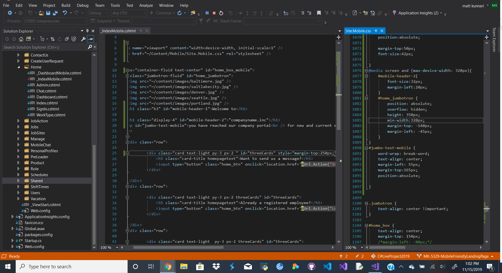
 
Once I got the mobile index implemented and the mobile CSS sorted out the view really started to come together.
 
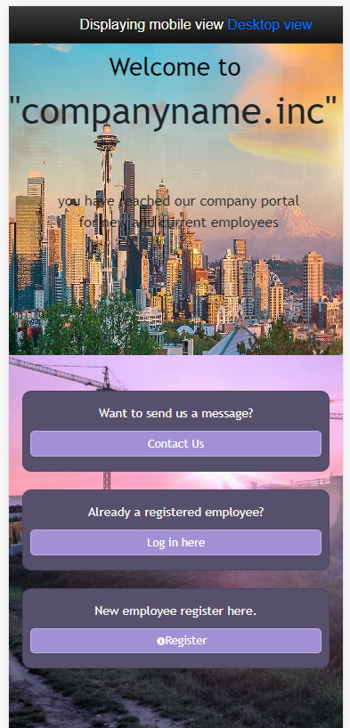
 
I just needed to test it across a range of devices to make sure that it would be flexible.
 
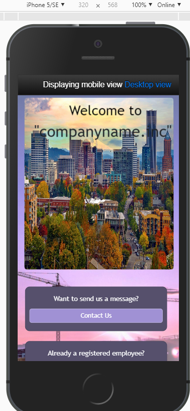
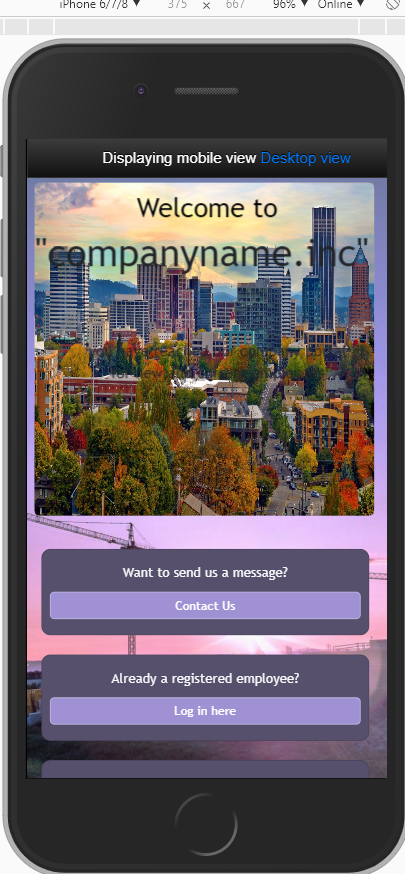
 

#### Other Skills Learned
 
•	During this sprint I learned a lot about working on the front end and I really enjoyed it.  
•	How to work on mobile views and how to really harness the power of flexible displays. 
•	Fixing initial oversights while not disrupting the functional code. 
•	Refactoring to simplify and streamline code. 
 
